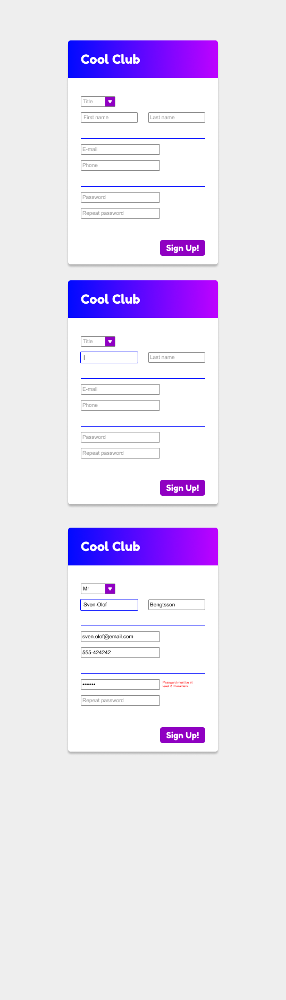

# HTML & CSS - Form Bootcamp

## 01 - Login Form

Börja din formulär-resa med att skapa upp ett väldigt simpelt inloggningsformulär innehållandes input-fält för användarnamn och lösenord. Inga fält får lämnas tomma.

Styla efter eget tycke och smak. Använd flexbox!

## 02 - Resebokning

Återskapa [följande formulär](https://www.figma.com/design/XenjCcyq3pZUOa9MF3urqQ/Vue.js-form-exercise---Book-a-flight?node-id=0-1&node-type=canvas&t=5vfXJrRCUghEo0pz-0) så pixel-perfekt du bara kan!

Använd grid för skapa den övergripande layouten, men också för själva formulär-delen (den med vit bakrund).

## 03 - Cool Club Signup Form

Återskapa formuläret på bilderna nedan. De olika varienterna visar hur formuläret ser ut i olika lägen av interaktion med användaren.

Tips! För att skapa upp felmeddelandet i den sista bilden kan du kombinera pseudoklassen :invalid med att skapa upp ett eget pseudoelement ::after.

Bonustips! Fastna inte på att styla select-elementet exakt som på bilden. Vissa saker går inte / är jävligt vsåra att styla. Detta är ett sådant exempel.

## 04 - Ganska tråkig bonusuppgift

Uppgiften [hittar du här](https://github.com/Santosnr6/formul-r-jobbans-kan)
