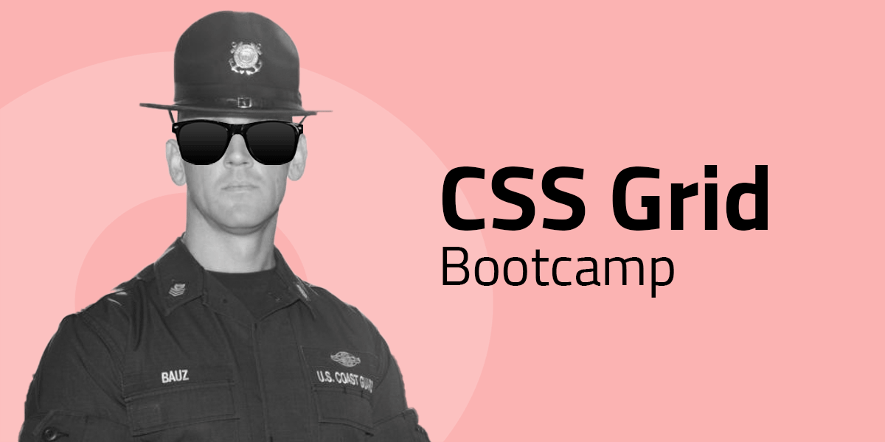

# CSS Grid Bootcamp

## 00. Grid dices

Använd endast HTML och CSS med ett grid för att göra en tärnings 6 olika sidor.

Gridsystemet bör vara uppsatt enligt skissed nedan.

| Bokstav | teknik     |
| ------- | ---------- |
| **A**   | static     |
| **B**   | grid areas |


Förslag på html-struktur:

```html
<article class="dice dots-6">
  <aside></aside>
  <aside></aside>
  <aside></aside>
  <aside></aside>
  <aside></aside>
  <aside></aside>
</article>
```

## Samma layout, olika tekniker

**Static grid** kallas det när _grid-items_ placeras ut i grid-systemet med exakta positioner. Här använder man sig av grid-column-start, grid-column-end, grid-row-start och grid-row-end, eller förkortningarna grid-column och grid-row. Ex.

```css
.grid-item {
  grid-column: 3 / 4;
  grid-row: 1 / 2;
}
```

**Flow grid** kallas det när _grid-items_ placeras ut i grid-systemet efter ett flöde. Istället för att tala om _var_ grid-item ska ligga, så låter man dem följa gridflödet och istället ange dess storlek, dvs. de kolumner och rader som ska tas upp. Ex.

```css
.grid-item {
  grid-column: auto / span 2;
  grid-row: auto / span 1;
}
```

**Grid areas** är ett tredje sätt att layouta med hjälp av grid som lägger man all layyoutinformation i _grid-containern_. Du namnger varje grid-item, och talar sedan i grid-containern om var den ska ligga med hjälp av strängar. Ex.

```css
.grid-container {
  grid-template-areas: "topbar topbar topbar";
  grid-template-rows: 4rem;
}

.grid-item {
  grid-area: "topbar";
}
```

## 01. Golden layout

| Bokstav | teknik     |
| ------- | ---------- |
| **A**   | static     |
| **B**   | flow       |
| **C**   | grid areas |


## 02. Dynamic layout

**Dynamic layout** är en grid-baserad layout som innehåller en _dynamisk yta_, d.v.s en yta som ska kunna växa / minska med innehållet i den.

De dynamiska ytorna visas med en _bakgrundsfärg_ i wireframen.

| Bokstav | teknik     |
| ------- | ---------- |
| **A**   | flow       |
| **B**   | grid areas |


## 03. Complex Dynamic layout

**Complex dynamic layout** är en grid-baserad layout som innehåller flera _dynamiska ytor_, d.v.s ytor som ska kunna växa / minska med innehållet i dem.

De dynamiska ytorna visas med en _bakgrundsfärg_ i wireframen.

| Bokstav | teknik     |
| ------- | ---------- |
| **A**   | flow       |
| **B**   | grid areas |


## 04. Static Calendar

Du ska med HMTL och CSS koda upp denna kalendermockup så pixelperfekt som möjligt.

Tekniker du ska använda dig av är:

- CSS grid
- Stoppa gärna in lite flexbox också. Var passar det bäst?


## 05. Poster Shop - veckans Code Review-uppgift

Försök återskapa layouten i övningen genom att använda dig av CSS Grid. Ta sedan med dig resultatet (lyckat eller ej) till torsdagens Code Review för att jämföra med dina klasskamrater, och förhoppningsvis skaffa dig lite nya intryck och insikter.

Övningen [hittar du här](https://github.com/fu-html-css-fe24/exercise-css-poster-shop)
